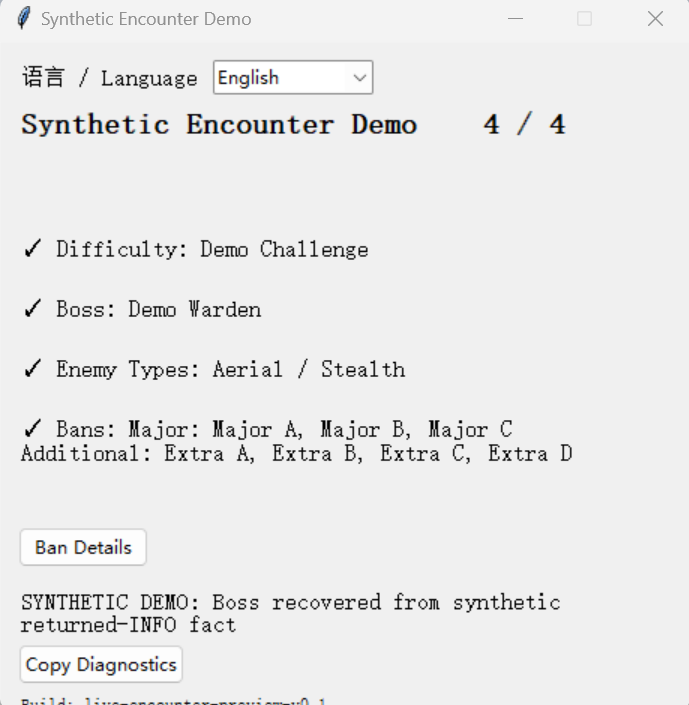
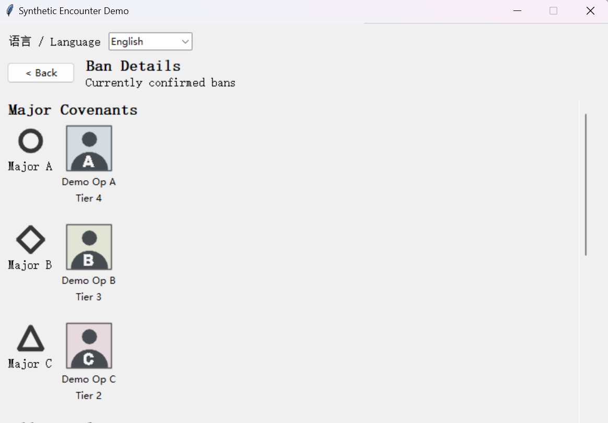
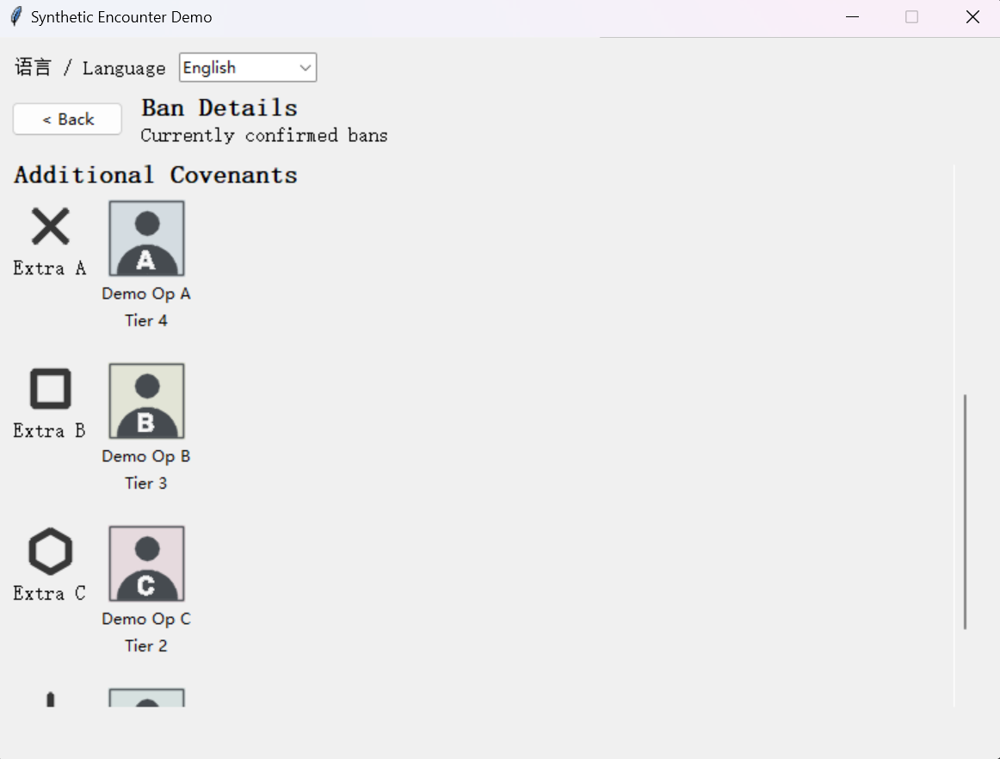

# Sentry Copilot

A read-only computer-vision desktop assistant for Arknights Sentry Protocol.

## Overview

Sentry Copilot captures the game client, recognizes encounter information visually, and
maintains confirmed facts across frames. It recovers missing information when the player returns
to an INFO page and presents the results in a compact desktop UI.

The engineering problem is not just recognizing a screenshot: information can be incomplete,
scroll out of view, or reappear during the same encounter. The application separates visual
observations, encounter lifecycle, confirmed state, and presentation so that a weak frame does
not erase a previously confirmed result. It never clicks, deploys units, or controls the game.

For a no-game preview of the four-fact Encounter flow, install the source checkout and run:

```bash
python -m sentry_copilot.cli demo-encounter --headless
```

This public demo uses project-authored synthetic facts rather than live computer vision and
requires no private reference pack. The repository does not redistribute game artwork,
recognition crops, recordings, or private portrait/icon caches.



Public synthetic Encounter demo at the completed **4 / 4** state; the displayed facts are
project-authored, not live computer-vision results.

## Current Live Encounter Intelligence

The live product has exactly four information items:

| Item | Current behavior |
| --- | --- |
| Difficulty | Visual classification with temporal confirmation and post-start recovery. |
| Boss | Catalog-backed visual identification on initial and returned INFO pages. |
| Enemy Types | Complete, confirmed enemy-category sets from supported INFO layouts. |
| Banned Covenants | Combines independent Major/Core and Additional Covenant snapshots. |

Complete supported progress is **4 / 4**. Major/Core recognition alone does not complete
Banned Covenants; both components are required. Covenant recognition supports AC-2, AC-3, and
AC-4. Standard / AC-1 explicitly shows Bans as unsupported rather than inventing a result.

Initial AC-4 / Ultimate Major recognition is implemented with bounded local crop refinement.
Additional Covenant recognition is scroll-aware but deliberately bounded; ambiguous or clipped
layouts can remain unresolved. See [Encounter Intelligence](docs/encounter-intelligence.md).

## Key Engineering Features

- Read-only MuMu renderer/framebuffer IPC capture and a secondary Windows-display source.
- Immutable NumPy-backed frames with source and timestamp provenance; local video and image
  sources for offline engineering.
- OpenCV visual observers using SIFT, geometric verification with RANSAC, and targeted
  template, shape, and color cues.
- Temporal confirmation, explicit encounter-start handling, returned-INFO recovery, sticky
  confirmed facts, and conservative conflict reporting.
- Catalog-driven banned-operator projection: all static recruitment routes must be known
  disabled before an operator is reported as confirmed banned.
- Immutable presentation models and tested UI-state helpers, including the seven-card
  Ban Detail layout.
- Typed Python, pytest, Ruff, strict mypy, and GitHub Actions checks.

## Architecture

```text
Capture
  -> Visual Observers
  -> Encounter Controller / EncounterSession
  -> Confirmed Facts
  -> Presentation Models
  -> Desktop UI
```

The encounter controller owns this live path. The separate strategy/player evidence subsystem
uses its own reducer and session state. Route projection/rendering is another independent
engineering subsystem; neither is presented as fully wired into the live encounter UI.

See [Architecture](docs/architecture.md) and the [documentation index](docs/README.md).

## Installation / Development

### Source checkout

Requires **Python 3.12 or newer**. Run from the repository root in an editable development
checkout; live capture and the desktop preview require Windows.

```powershell
# Windows PowerShell
py -3.12 -m venv .venv
.\.venv\Scripts\python.exe -m pip install -e ".[dev]"
.\.venv\Scripts\Activate.ps1
```

```bash
# macOS/Linux (public tests and headless demo)
python3.12 -m venv .venv
.venv/bin/python -m pip install -e ".[dev]"
source .venv/bin/activate
```

With the environment activated, the public development checks are:

```bash
pytest
ruff check .
python -m mypy
python tools/validate_repository.py
python -m sentry_copilot.cli --help
```

### Local built wheel

The project is not presented as a PyPI package. To verify a wheel built from this checkout,
build it locally and install that file into a separate environment:

```bash
python -m pip wheel --no-deps --wheel-dir dist .
python -m venv .wheel-venv
# Windows: .\.wheel-venv\Scripts\python.exe -m pip install .\dist\sentry_copilot-0.1.0-py3-none-any.whl
# macOS/Linux: .wheel-venv/bin/python -m pip install dist/sentry_copilot-0.1.0-py3-none-any.whl
```

The wheel environment exposes `sentry-copilot` under its `Scripts` directory on Windows or
`bin` directory on macOS/Linux; the synthetic headless demo still needs no private resources.

For live recognition, locally supplied private reference packs are required. On the calibrated
JP MuMu 1920x1080 profile:

```powershell
python -m sentry_copilot.cli live-encounter-preview `
  --capture-backend mumu-ipc `
  --mumu-install-root '<MuMu install root>' `
  --mumu-ipc-dll '<path to external_renderer_ipc.dll>' `
  --mumu-instance-id 0 `
  --mumu-display-id 0 `
  --locale en
```

Replace the placeholders with paths from the local MuMu installation. The IPC DLL is not bundled.
The desktop shell supports English (`--locale en`) and Chinese (`--locale zh_CN`) modes.
Some game entity names retain Chinese/localized catalog labels when no deliberate English
display name exists. The secondary physical-display path is:

```powershell
python -m sentry_copilot.cli live-encounter-preview --capture-backend windows-display --monitor 1 --locale en
```

A display capture still needs the calibrated game-content layout; it is not automatic window or
viewport discovery. Because this fallback captures the physical display, keep the assistant
window and other overlays outside calibrated game ROIs. MuMu IPC instead captures the game
framebuffer directly, excluding desktop windows. Without the private reference packs, launching
the live panel does not reproduce meaningful real-game recognition. The public synthetic demo
below demonstrates the downstream product pipeline, not recognition.

An independent, entirely synthetic route demonstration is available:

```bash
python -m sentry_copilot.cli validate-data --maps data/maps
python -m sentry_copilot.cli demo-route-overlay --map-file data/maps/demo.synthetic_training_map.yaml --output outputs/demo_route_overlay.png
```

This demonstrates projection/rendering, not real-game encounter recognition or verified game routes.
See [Contributing](CONTRIBUTING.md) for development boundaries.

## Public synthetic demo

After the editable install, try the main Encounter UI without a game installation or private
reference pack:

```bash
sentry-copilot demo-encounter
sentry-copilot demo-encounter --headless
```

The GUI reuses the production session updates, presentation models, and desktop window with
project-authored synthetic facts and procedural icons/portraits in the production Ban Detail
media/card layout. It automatically walks from
`0 / 4` to `4 / 4`, including Major-only incomplete Bans and a simulated missing-Boss recovery,
then stays open until closed. No game artwork, private portrait/icon cache, MuMu, or recordings
are required; demo graphics are generated in memory, without redistributed game/wiki images.

This is **not live computer vision**: synthetic confirmed facts enter the session directly.
The same deterministic timeline is printed by `--headless`, without importing or initializing Tk.
GUI playback needs Python's Tk support and a desktop display. English is the default shell locale;
use `--locale zh_CN`, `--step-seconds 1.25`, or `--no-topmost` as needed.

Synthetic Ban Detail examples for Major and Additional Covenants, using procedural Covenant
icons and fictional operator avatars, not game artwork:

<p>
  
  
</p>

## Public vs Private Resources

The public checkout contains code, tests, schemas, synthetic graphics, and game-related catalog
metadata, including localized names and provenance references. It does not distribute the
recognition reference images, gameplay recordings, or private portrait/icon packs used during
development and validation.

`data/private/`, `local_data/`, and generated `outputs/` are ignored by Git. Recognition loaders
use explicitly declared local resources rather than treating arbitrary directory contents as
validated references. Resource availability and source permissions are separate concerns; see
[Third-party notices](THIRD_PARTY_NOTICES.md).

## Validation / Testing

Public automated tests cover domain invariants, synthetic visual inputs, temporal confirmation,
lifecycle/recovery, conflicts, capture adapters, catalog validation, presentation, and route
projection. CI runs pytest, Ruff, strict mypy, repository validation, and synthetic-demo checks
from both the source checkout and an isolated wheel installation on Python 3.12.

Private live and retained-frame checks informed the calibrated recognition implementation, but
their media is not distributed. Public tests do not reproduce every private validation scenario
and do not establish universal real-game recognition accuracy. Synthetic strategy-catalog
validation is not validation of a real game revision.

See [Validation boundaries](docs/validation.md) for what can be reproduced publicly.

## Known Limitations

- Real encounter recognition is calibrated for the Japanese client on MuMu at 1920x1080,
  not arbitrary languages, resolutions, or UI scaling.
- Meaningful real-game recognition requires private/local reference assets.
- Additional Covenant recognition can remain unresolved at extreme low-row scroll positions;
  partial geometry or ambiguous glyphs are not forced into a complete result.
- Standard / AC-1 Bans recognition is unsupported.
- Public tests cannot reproduce all private live-validation evidence.

## Supporting Modules

**Strategy/player evidence:** revision-aware catalogs, immutable prebattle evidence, ready
commitments, battle participation, participant association, conflict-aware strategy occupancy,
and explicit corrections. These are supporting APIs and visual/probe components, not a claim
that the live encounter panel tracks every player's strategy.

**Route projection/rendering:** ruleset- and map-scoped YAML, normalized battlefield coordinates,
homography calibration, route filtering, and rendering with explicit unknown/no-overlay results
when recognition or calibration is insufficient. The synthetic demonstration is independently
testable. See [Strategy evidence](docs/strategy-commitment.md) and [Routes](docs/route-system.md).

## License / Attribution

Project code is covered by [LICENSE](LICENSE). Game-related metadata and external-resource
provenance are described in [THIRD_PARTY_NOTICES.md](THIRD_PARTY_NOTICES.md); the code license
does not establish rights to third-party content.
